<div align="center">

# Yiğit - Software Engineer & Security Researcher


[](https://crewdev.com.tr)
[](https://discord.com)


</div>

---

## 🎯 About Me

Passionate software engineer specializing in full-stack development and cybersecurity. I build secure, scalable, and user-centric digital solutions using cutting-edge technologies.

```typescript
interface Developer {
  name: string;
  role: string[];
  expertise: string[];
  currentFocus: string;
  philosophy: string;
}

const crew: Developer = {
  name: "Yiğit",
  role: ["Full Stack Developer", "Security Researcher", "Product Designer"],
  expertise: ["Web Development", "Mobile Apps", "Cybersecurity", "System Architecture"],
  currentFocus: "Advanced Security Architectures & Scalable Systems",
  philosophy: "Code is poetry, security is art - You dream it, I build it."
};
```

---

## 🔐 Cybersecurity Expertise

Specialized in penetration testing, security architecture, and ethical hacking. I identify vulnerabilities, secure applications, and build robust defense mechanisms for digital ecosystems.

### Security Toolkit

<table>
<tr>
<td align="center" width="96">

<br>Kali Linux
</td>
<td align="center" width="96">

<br>Wireshark
</td>
<td align="center" width="96">

<br>Metasploit
</td>
<td align="center" width="96">

<br>Nmap
</td>
<td align="center" width="96">

<br>Burp Suite
</td>
<td align="center" width="96">

<br>Docker
</td>
</tr>
</table>

**Security Focus Areas:** Web Application Security • Network Defense • Penetration Testing • OWASP Top 10 • Secure SDLC

---

## 💼 Tech Stack

### Languages

<table>
<tr>
<td align="center" width="96">

<br>JavaScript
</td>
<td align="center" width="96">

<br>TypeScript
</td>
<td align="center" width="96">

<br>Python
</td>
<td align="center" width="96">

<br>PHP
</td>
<td align="center" width="96">

<br>Rust
</td>
<td align="center" width="96">

<br>Go
</td>
</tr>
<tr>
<td align="center" width="96">

<br>C++
</td>
<td align="center" width="96">

<br>C#
</td>
<td align="center" width="96">

<br>Java
</td>
<td align="center" width="96">

<br>Dart
</td>
<td align="center" width="96">

<br>Ruby
</td>
<td align="center" width="96">

<br>Lua
</td>
</tr>
</table>

### Frameworks & Libraries

<table>
<tr>
<td align="center" width="96">

<br>React
</td>
<td align="center" width="96">

<br>Next.js
</td>
<td align="center" width="96">

<br>Vue.js
</td>
<td align="center" width="96">

<br>Express
</td>
<td align="center" width="96">

<br>Node.js
</td>
<td align="center" width="96">

<br>Flutter
</td>
</tr>
</table>

### Databases & Cloud

<table>
<tr>
<td align="center" width="96">

<br>MySQL
</td>
<td align="center" width="96">

<br>PostgreSQL
</td>
<td align="center" width="96">

<br>MongoDB
</td>
<td align="center" width="96">

<br>Firebase
</td>
<td align="center" width="96">

<br>Redis
</td>
<td align="center" width="96">

<br>Docker
</td>
</tr>
</table>

### Tools & Platforms

<table>
<tr>
<td align="center" width="96">

<br>Git
</td>
<td align="center" width="96">

<br>Unity
</td>
<td align="center" width="96">

<br>Unreal
</td>
<td align="center" width="96">

<br>WordPress
</td>
<td align="center" width="96">

<br>Blender
</td>
<td align="center" width="96">

<br>Photoshop
</td>
</tr>
</table>

### Operating Systems

<table>
<tr>
<td align="center" width="96">

<br>Linux
</td>
<td align="center" width="96">

<br>Ubuntu
</td>
<td align="center" width="96">

<br>Debian
</td>
<td align="center" width="96">

<br>Windows
</td>
<td align="center" width="96">

<br>macOS
</td>
</tr>
</table>

---

## 📊 GitHub Analytics

<div align="center">
  
  
</div>

<div align="center">
  
</div>

---

## 🏆 Achievements

<div align="center">
  
</div>

---

## 📈 Contribution Graph

<div align="center">
  
</div>

---

## 🎯 Current Focus

```mermaid
mindmap
  root((Yiğit))
    Development
      Full Stack Apps
      Mobile Solutions
      API Design
    Security
      Penetration Testing
      Secure Architecture
      Threat Analysis
    Learning
      Cloud Native
      Advanced Rust
      ML Security
```



---

<div align="center">

### 🤝 Let's Connect & Collaborate

[](https://crewdev.com.tr)
[](https://discord.com)

---


**"Transforming ideas into secure, elegant code"** 

⭐ If you find my work interesting, consider leaving a star on repositories you like!

</div>
